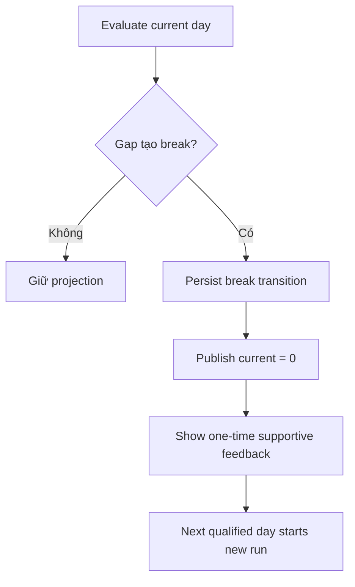

# Đặc tả UI/UX hoàn chỉnh — Handle Streak Break

Flow này nhận transition từ active streak sang broken state và cung cấp feedback một lần, không mang tính trừng phạt.

## 1. Nguyên tắc đã chốt

- Break chỉ xảy ra sau khi effective day vượt quá ngày đủ điều kiện theo policy.
- Mỗi break transition phát feedback tối đa một lần.
- Không xóa qualified-day history hoặc longest streak.
- Học trong ngày mới bắt đầu run mới từ 1.
- Copy không đánh đồng streak với Goal failure.

## 2. Master flow

## 3. Presentation contract

- Dashboard nêu streak reset và CTA học hôm nay, không modal chặn.
- Statistics vẫn hiển thị historical run/longest.
- Feedback có text/icon, không chỉ đổi màu flame.

## 4. Lifecycle

- App opens nhiều lần cùng day không lặp feedback.
- Late sync có thể phục hồi run qua reconciliation và thu hồi stale break state.
- Failure lưu feedback marker không được thay đổi calculation result.

## 5. State matrix

- One-day/multi-day gap, first break, repeated app open.
- Late event repairs gap, timezone change, feedback persistence failure.
- Large counts/copy, light/dark.

## 6. Acceptance criteria

- Break transition deterministic và không lặp feedback.
- History/longest được giữ.
- New qualified day bắt đầu đúng run mới.
- Goal state không làm thay đổi break calculation.
