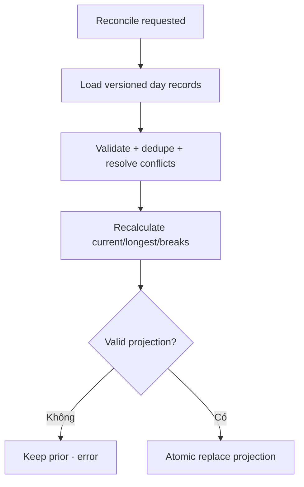

# Đặc tả nghiệp vụ hoàn chỉnh — Reconcile Streak History

Flow này rebuild streak projection khi có late sync, restore, corrected day records hoặc formula migration.

## 1. Nguyên tắc đã chốt

- Qualified-day records là source; projection có thể rebuild.
- Rebuild không tạo/xóa Study Sessions.
- Duplicate/conflicting day records được resolve theo stable identity và policy.
- Apply projection atomic; reader thấy old hoặc new version, không thấy half-state.
- Reconciliation retry idempotent.

## 2. Master flow

## 3. Trigger contract

- Late synced/restored records, timezone correction, corruption repair hoặc formula upgrade.
- Trigger có reason, requested version và correlation id.
- Concurrent requests coalesce hoặc serialize.

## 4. Lifecycle

- Building giữ prior projection với stale indicator khi cần.
- Failure giữ source/prior projection và cho Retry.
- Success publish changed ranges để Dashboard/Statistics refresh.

## 5. State matrix

- No-op, added day, removed invalid duplicate, repaired gap.
- Large history, conflict, invalid future day, formula migration.
- Interrupted rebuild, retry, concurrent sync/restore.

## 6. Acceptance criteria

- Rebuild deterministic từ cùng source/version.
- Reader không thấy partial projection.
- Failure không mất history hoặc last good projection.
- Late data cập nhật current/longest đúng một lần.
