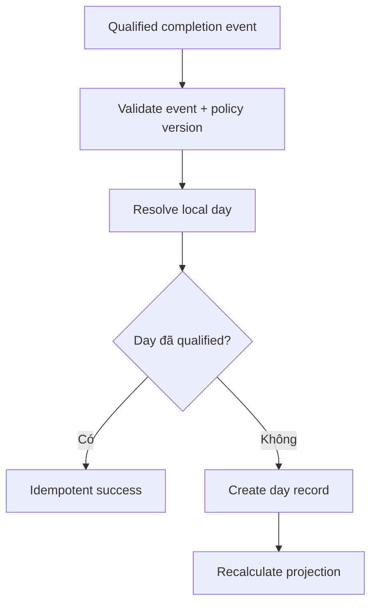

# Đặc tả nghiệp vụ hoàn chỉnh — Record Streak Day

Flow này nhận finalized qualified Study activity và đánh dấu local day đóng góp cho streak theo cách idempotent.

## 1. Nguyên tắc đã chốt

- Chỉ event đã finalized và đạt qualification policy mới được ghi.
- Identity ngày là calendar date trong timezone contract, không phải UTC date thuần.
- Một ngày có tối đa một qualified-day record.
- Retry/sync cùng source event không double-count.
- Ghi streak không được rollback Study Session đã thành công.

## 2. Master flow

## 3. Data contract

- Stable day id, local date, timezone id/offset snapshot và policy version.
- Source event ids có thể audit/dedupe nhưng không duplicate contribution.
- Manual/unfinalized/deleted-draft activity không đủ điều kiện.

## 4. Failure và reconciliation

- Invalid event fail closed và không tạo ngày.
- Storage failure vào retry queue với cùng identity.
- Late event được ghi rồi chuyển sang reconciliation nếu ảnh hưởng lịch sử.
- Projection failure không làm mất qualified-day record đã commit.

## 5. State matrix

- First event, same-day repeat, late event, duplicate retry.
- Midnight/timezone/DST, malformed event, storage failure.

## 6. Acceptance criteria

- Một local day đóng góp tối đa một lần.
- Cùng event/day retry trả kết quả cũ.
- Day resolution deterministic và audit được.
- Không phụ thuộc Daily Goal enabled/met.
