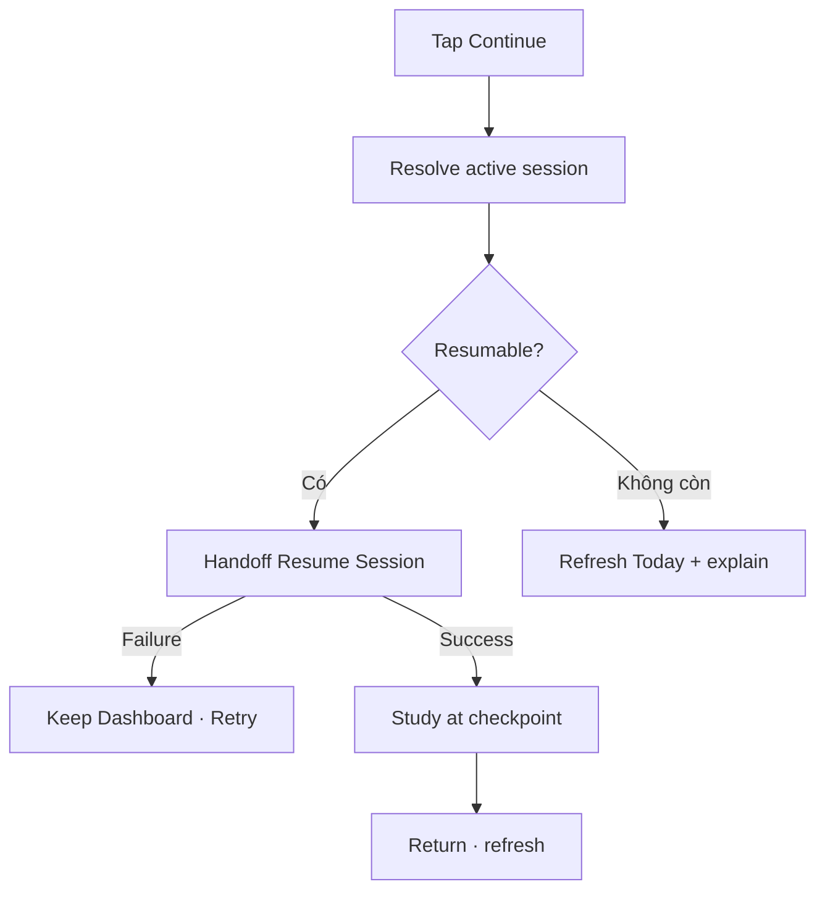

# Đặc tả UI/UX hoàn chỉnh — Continue Session from Today

Flow này revalidate paused Session và handoff tới Resume Study Session từ primary CTA Today.

## 1. Nguyên tắc đã chốt

- CTA chỉ hiện khi có resumable active session.
- Session được resolve lại trước navigation; card/deck changes theo Resume contract.
- Double tap tạo một handoff.
- Resume failure không xóa session hoặc Dashboard state.
- Return refresh toàn bộ Today projections.

## 2. Master flow

## 3. Objective và composition

- Objective: quay lại đúng checkpoint bằng một CTA.
- Primary CTA: `Continue learning` với Deck/stage context phụ.
- Loading gắn trên CTA; supporting cards vẫn đọc được.

## 4. Lifecycle

- Handoff token chặn duplicate navigation.
- Incompatible/corrupt session dùng Resume recovery contract.
- Session finalized elsewhere làm CTA biến mất sau refresh.
- Offline local resume được hỗ trợ theo Session contract.

## 5. State matrix

- Valid, stale/finalized, Deck/Card changed, resume failure.
- Rapid tap, app background, return after exit/finalize.
- Long Deck/stage labels, large font, light/dark.

## 6. Acceptance criteria

- Continue luôn mở current checkpoint hoặc recovery rõ.
- Không tạo session mới.
- Failure giữ Today usable.
- Return cập nhật Due/Goal/Streak/Session summaries.
