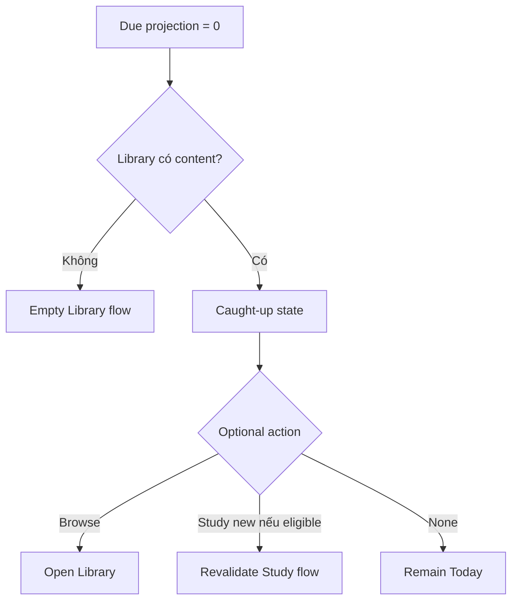

# Đặc tả UI/UX hoàn chỉnh — Handle Caught Up Today

Flow này hiển thị trạng thái Library có nội dung nhưng không còn Card due/relearn cần học hôm nay.

## 1. Nguyên tắc đã chốt

- Caught-up yêu cầu Library có eligible content và due count xác nhận bằng 0.
- Không đồng nghĩa Goal đã đạt hoặc Library empty.
- Không tạo due Card giả để cung cấp CTA.
- Optional actions chỉ handoff Browse/Study new content theo policy.
- Feedback tích cực nhưng không chặn Dashboard.

## 2. Master flow

## 3. Objective và composition

- Objective: xác nhận đã xử lý nội dung due và gợi ý bước tiếp theo hợp lệ.
- Archetype: Positive empty state.
- Goal/Streak summaries vẫn hiển thị độc lập.

## 4. Lifecycle

- Refresh có due mới thay state bằng Start review.
- Browse return giữ Today context và refresh.
- Optional new-study action phải revalidate eligibility.

## 5. State matrix

- Goal met/not met, streak active/reset, content one/dense.
- New due arrives, stale/offline projection, long copy.
- Large font, narrow, light/dark.

## 6. Acceptance criteria

- Không trộn caught-up với empty/error.
- Goal state không quyết định caught-up.
- Optional action không bypass Study eligibility.
- Refresh chuyển state đúng khi due thay đổi.
