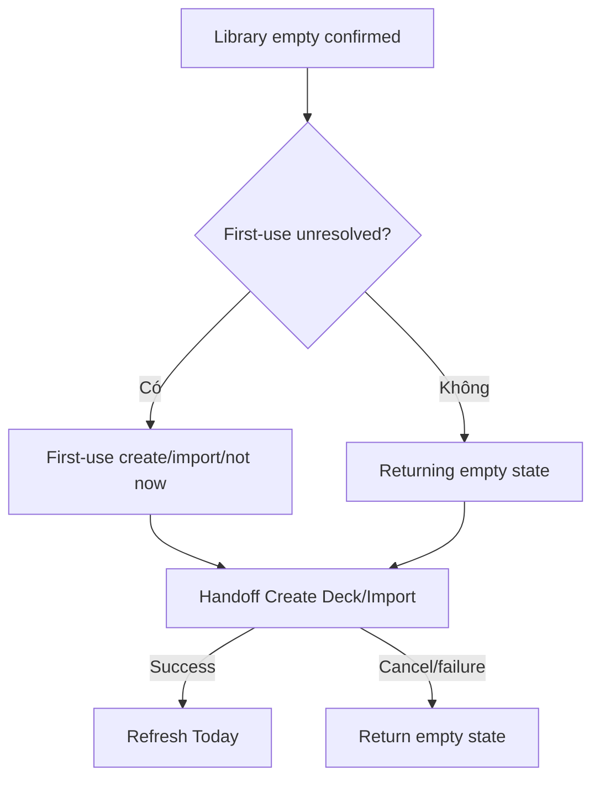

# Đặc tả UI/UX hoàn chỉnh — Handle Empty Library Today

Flow này xử lý Dashboard khi không có Deck/Card học được, gồm fresh user và user đã bỏ qua onboarding.

## 1. Nguyên tắc đã chốt

- Empty được xác định từ Library source, không từ Search/filter.
- Fresh first-use và returning empty dùng copy/context khác nhau nhưng cùng business state.
- `Not now` không tự mở onboarding lại.
- Create/Import chỉ handoff owning flows.
- Deleted-last-content refresh về Empty an toàn.

## 2. Master flow

## 3. Objective và composition

- Objective: giúp user tạo/import nội dung đầu tiên.
- Archetype: Actionable empty state.
- Chính xác một primary CTA; alternate action secondary.
- Không hiển thị due/goal progress giả khi thiếu content.

## 4. Lifecycle

- Create/Import cancel giữ empty context.
- Success chỉ rời Empty sau source commit và refresh.
- Onboarding skipped marker ngăn auto-open lặp.
- Load failure không được render như Empty.

## 5. State matrix

- First-use, skipped, returning, last content deleted.
- Create/import cancel/failure/success, load error/offline unknown.
- Long localized copy, large font, narrow, light/dark.

## 6. Acceptance criteria

- Empty chỉ hiển thị khi source xác nhận.
- Not now được tôn trọng.
- Actions handoff đúng Create/Import flows.
- Success refresh thành trạng thái Today phù hợp.
