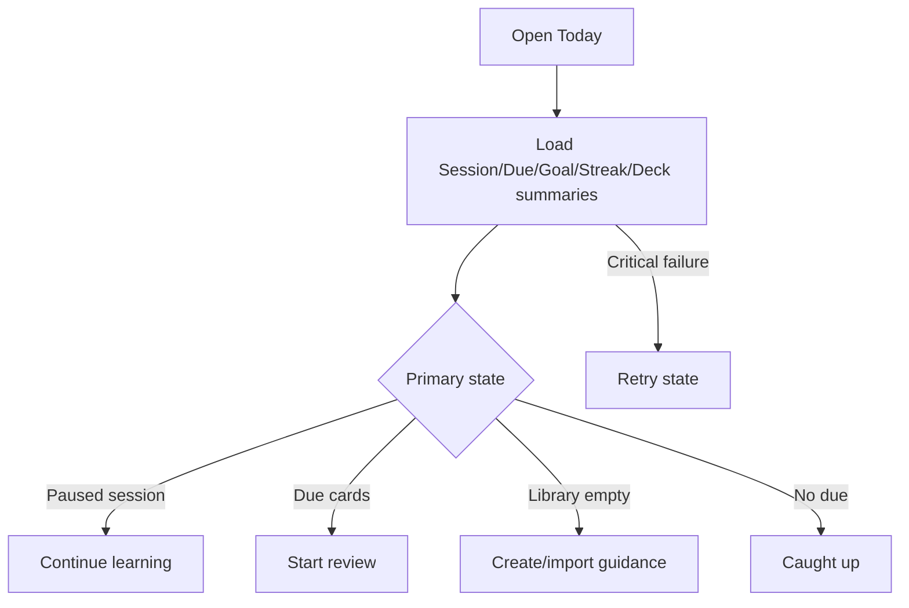

# Đặc tả UI/UX hoàn chỉnh — Load Today Dashboard

Flow này compose Due, Goal, Streak, paused Session và recent Deck projections thành trạng thái Today nhất quán.

## 1. Nguyên tắc đã chốt

- Dashboard không tự tính SRS, Goal hoặc Streak.
- Một load dùng projection snapshot/version đủ nhất quán để tránh CTA mâu thuẫn.
- Paused Session hợp lệ được ưu tiên làm primary CTA.
- Empty Library khác caught-up và load failure.
- Partial supporting section failure không che primary action nếu action vẫn xác định được.

## 2. Master flow

## 3. Objective và composition

- Objective: tiếp tục hoặc bắt đầu hành động học phù hợp nhất.
- Archetype: Today dashboard.
- Chính xác một primary CTA; summaries Goal/Streak/Deck là supporting sections.
- Một top-level heading; skeleton giữ hierarchy.

## 4. Lifecycle

- Loading không hiển thị số 0 giả.
- Partial data có unavailable marker/refresh.
- Critical retry giữ last-good snapshot nếu có.
- Foreground dùng refresh flow, không tạo duplicate load races.

## 5. State matrix

- Paused, due, not-studied, goal-met, streak-reset, caught-up.
- Empty/fresh/after-skip, loading, partial, offline/error/stale.
- Long greeting/Deck names, large counts/font, narrow, light/dark.

## 6. Acceptance criteria

- Primary CTA không mâu thuẫn current projections.
- Empty/caught-up/error phân biệt rõ.
- Dashboard không persist nguồn business.
- Stale response không thay thế snapshot mới hơn.
