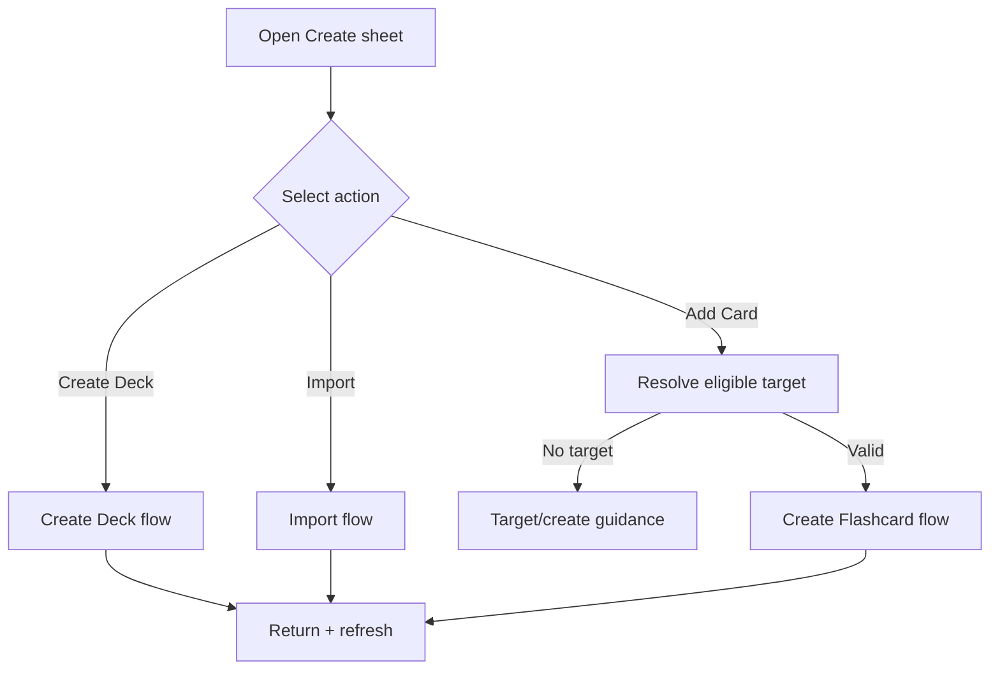

# Đặc tả UI/UX hoàn chỉnh — Manage Today Create Actions

Flow này quản lý action sheet Add Card, Create Deck và Import từ Today mà không sở hữu mutation tương ứng.

## 1. Nguyên tắc đã chốt

- Action visibility dựa current Library context/capability.
- Add Card cần eligible target; nếu thiếu phải chọn/tạo Deck trước.
- Create Deck và Import handoff nguyên draft/context cần thiết.
- Dismiss không mutate business data.
- Return sau success refresh Today và highlight/recent context khi phù hợp.

## 2. Master flow

## 3. Objective và composition

- Objective: chọn đúng loại nội dung cần tạo từ một entry point.
- Archetype: Action sheet.
- Mỗi action có label/description/icon; không có nested destructive controls.

## 4. Lifecycle

- Sheet dùng latest capability snapshot nhưng selected action revalidate.
- Cancel owning flow quay lại Today, không reopen sheet tự động.
- Failure nằm trong owning flow; Today giữ context.
- Double selection chỉ handoff một flow.

## 5. State matrix

- Empty Library, has eligible Deck, only Parent/no target.
- Sheet open/dismiss, rapid tap, return success/cancel/failure.
- Long labels, large font, narrow, light/dark.

## 6. Acceptance criteria

- Add Card không bypass target eligibility.
- Sheet không trực tiếp persist Deck/Card/Import.
- Dismiss không có side effect.
- Success refresh Today đúng một lần.
