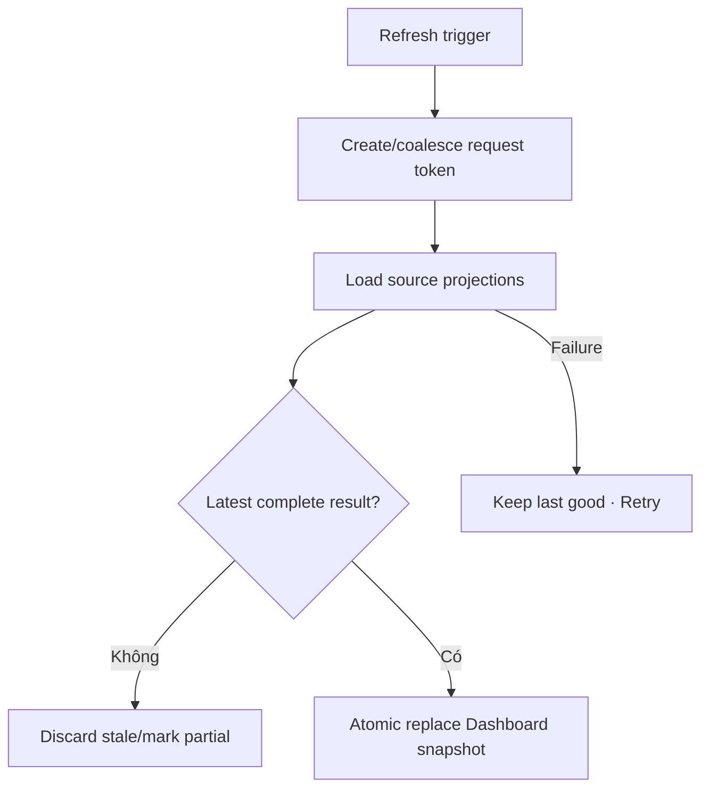

# Đặc tả UI/UX hoàn chỉnh — Refresh Today Projections

Flow này refresh Today khi pull-to-refresh, app foreground hoặc business event thay đổi Session/Due/Goal/Streak/Deck.

## 1. Nguyên tắc đã chốt

- Mỗi refresh có request token; response cũ không ghi đè snapshot mới.
- Pull/foreground/event triggers có thể coalesce.
- Refresh failure giữ last-good Dashboard với stale marker.
- Partial source failure không tạo số 0 giả.
- Refresh không tự mutate source business objects.

## 2. Master flow

## 3. Trigger contract

- App foreground/day boundary, Study exit/finalize, Deck/Card mutation, Goal/Streak update và manual pull.
- Event trigger có source version để tránh refresh loop.
- Initial load dùng Load Today contract; refresh giữ current layout.

## 4. Lifecycle

- Pull indicator/inline refresh không blank content.
- Day boundary có thể đổi primary state và summaries cùng snapshot.
- Background result chỉ apply nếu token/latest context còn hợp lệ.

## 5. State matrix

- Manual/foreground/event/day-boundary refresh.
- Success/no-change/partial/offline/failure, rapid/coalesced triggers.
- User navigates away/back, long-running refresh.

## 6. Acceptance criteria

- Dashboard áp dụng snapshot mới atomically.
- Last-good data giữ được khi refresh lỗi.
- Stale response không đổi CTA/state.
- Không hiển thị unavailable source như zero.
