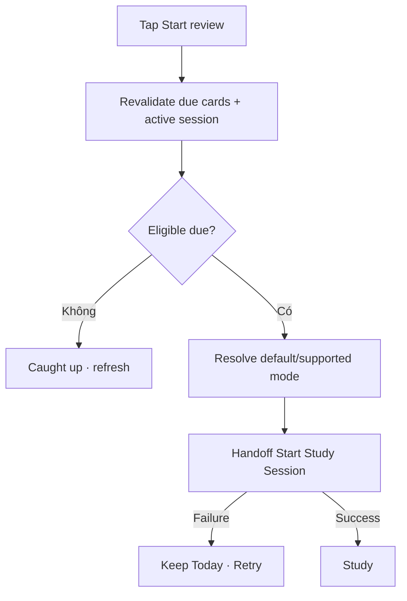

# Đặc tả UI/UX hoàn chỉnh — Start Review from Today

Flow này chuyển current due scope từ Today tới Study Mode/Session sau revalidation cuối.

## 1. Nguyên tắc đã chốt

- Due count trên Dashboard chỉ là projection; Start recompute eligibility.
- Nếu có paused Session, priority/choice theo Session contract.
- Scope/mode phải đáp ứng minimum tại thời điểm Start.
- Dashboard không tự tạo session record.
- Count thay đổi được thông báo trước khi tiếp tục nếu ảnh hưởng đáng kể.

## 2. Master flow

## 3. Objective và composition

- Objective: bắt đầu review due cards nhanh và đúng scope.
- Primary CTA: `Start review` kèm due count hỗ trợ.
- Mode choice chỉ xuất hiện khi cần; default từ Preferences được validate.

## 4. Lifecycle

- Starting khóa CTA/double tap.
- No longer due chuyển caught-up, không báo lỗi.
- Start failure giữ Dashboard snapshot và selection.
- Return refresh projections.

## 5. State matrix

- Due one/many, active session, mode invalid/minimum unmet.
- Count changed, caught-up during start, start failure/success.
- Long count/copy, large font, narrow, light/dark.

## 6. Acceptance criteria

- Session chỉ do Start Session contract tạo.
- Stale due count không tạo empty/invalid session.
- Double tap tạo tối đa một start request.
- Return phản ánh progress mới.
