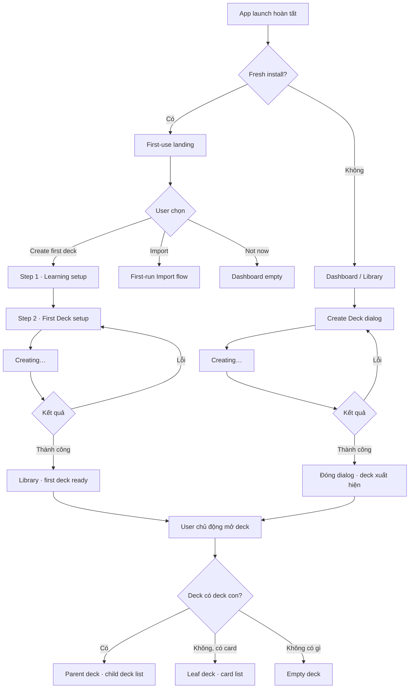

# Đặc tả UI/UX hoàn chỉnh — Create Deck

Phạm vi tài liệu này chỉ mô tả luồng nghiệp vụ và giao diện. Không đề cập schema, migration hoặc cách lưu dữ liệu.

## 1. Nguyên tắc đã chốt

- First-run dùng focused full-screen setup, không dùng dialog.
- Từ deck thứ hai trở đi dùng Create Deck dialog.
- Deck mới được tạo ở trạng thái rỗng.
- Không tự động tạo card hoặc nested deck.
- Không hỏi `Default view`, `Cards` hay `Nested decks` lúc tạo.
- Chỉ leaf deck — deck không có deck con — mới được chứa card.
- Parent deck chỉ quản lý danh sách deck con.
- Parent deck không được đồng thời hiển thị danh sách card trực tiếp.
- Nội dung đầu tiên user thêm sau khi tạo sẽ xác định cách deck được sử dụng.

## 2. Phân loại entry point

| Context                      | Hành động                  | Presentation                      |
| ---------------------------- | -------------------------- | --------------------------------- |
| Fresh install                | Create first deck          | Full-screen setup                 |
| Fresh install                | Import                     | Full-screen import                |
| Dashboard thông thường       | Create deck                | Dashboard action sheet → dialog   |
| Library root                 | New deck                   | Mở dialog trực tiếp               |
| Library empty sau onboarding | Create deck                | Mở dialog trực tiếp               |
| Parent deck                  | Create deck                | Dialog với parent context         |
| Empty deck                   | Create nested deck         | Dialog với parent context         |
| Leaf deck có card            | Organise into nested decks | Conversion dialog                 |
| User cũ không còn deck       | Create deck                | Dialog, không chạy lại onboarding |

# 3. Master flow



# 4. First-use landing

## Objective

Giúp user bắt đầu bằng một Deck đầu tiên hoặc import nội dung có sẵn.

## Archetype

Selection.

## Composition

```text
MemoX

Build your learning library

Create your first deck and add content whenever you’re ready.
MemoX will schedule reviews after you start studying.

[ Create your first deck ]
  Import existing cards

Not now
```

## Quy tắc UI

- Không dùng dialog.
- Không hiển thị bottom navigation trong focused first-use experience.
- Một primary CTA: `Create your first deck`.
- Secondary: `Import existing cards`.
- Tertiary link: `Not now`.
- Không hiển thị carousel hoặc ba hàng “How MemoX works”.
- Không yêu cầu account, notification, reminder, daily goal hoặc theme.
- Không tự động mở setup trước khi user chọn Create.

## Hành vi

- `Create your first deck` → Step 1.
- `Import existing cards` → First-run Import flow.
- `Not now` → Dashboard empty.
- Nếu user đã chọn `Not now`, app không tự động bật lại onboarding ở lần launch tiếp theo; Dashboard empty vẫn có CTA tạo deck.

# 5. Step 1 — Learning setup

## Objective

Xác định learning context cần thiết cho Deck đầu tiên.

## Archetype

Focused form.

## Composition

```text
←                                           Step 1 of 2

Set up your learning

What are you learning? *
[ Korean                                         ▾ ]

Show meanings in *
[ Vietnamese                                     ▾ ]

You can add more language pairs later.

                                         [ Continue ]
```

## Required fields

- Learning language.
- Meaning/native language.

## Validation

- Cả hai field đều phải có giá trị.
- Không cho Continue nếu required field chưa hoàn tất.
- Lỗi nằm ngay dưới field.
- Language name dài phải wrap, không ellipsis thông tin quan trọng.

## Không xuất hiện ở Step 1

- Deck name.
- Description.
- Cards/Nested decks.
- Daily goal.
- Notification.
- Reminder.
- Account/sync.

# 6. Step 2 — First Deck setup

## Objective

Tạo Deck đầu tiên với metadata cơ bản, chưa thêm nội dung.

## Archetype

Focused form.

## Composition

```text
←                                           Step 2 of 2

Create your first deck

Korean → Vietnamese                         Change

REQUIRED

Deck name *
[ Korean TOPIK I                                ]

OPTIONAL                                      Show

                                     [ Create deck ]
```

Khi mở Optional:

```text
OPTIONAL                                      Hide

Description
[ Vocabulary and grammar for TOPIK I            ]
```

## Field rules

### Deck name

- Required.
- Auto-focus.
- Validation rỗng, quá dài và trùng tên.
- Trim whitespace khi kiểm tra.
- Lỗi hiển thị dưới field.

### Language pair summary

- Hiển thị rõ pair đã chọn.
- `Change` quay về Step 1.
- Không mở Settings.

### Description

- Optional.
- Thu gọn mặc định.
- Không chặn Create nếu bỏ trống.

## Không có

- Default view.
- Cards/Nested decks selector.
- Add card.
- Import.
- Study settings.

# 7. Submit lifecycle — first-run

## Idle

- Fields editable.
- Create Deck là primary CTA.

## Invalid

- Giữ nguyên dữ liệu.
- Focus field đầu tiên có lỗi.
- Hiện lỗi inline.

## Submitting

```text
[ Creating… ]
```

- Disable toàn bộ field.
- Disable Back và double-submit.
- Giữ layout ổn định; không làm CTA thay đổi kích thước.

## Recoverable failure

```text
Couldn’t create the deck.
Your information is still here. Try again.

[ Try again ]
```

- Giữ nguyên toàn bộ input.
- Cho phép Back sau khi lỗi.
- Không chuyển sang màn khác.

## Success

- Không mở card editor.
- Không mở deck ngay.
- Chuyển đến Library.
- Highlight Deck vừa tạo.
- Hiện contextual callout:

```text
Your first deck is ready

Add cards or organise it into smaller decks whenever you’re ready.

Open deck                                              ×
```

User có thể bỏ qua callout và sử dụng navigation bình thường.

# 8. Create Deck dialog thông thường

Áp dụng cho user đã có learning context.

## Root deck dialog

```text
Create deck
Inside Library

REQUIRED

Deck name *
[ Korean TOPIK II                               ]

Language pair *
[ Korean → Vietnamese                         ▾ ]

OPTIONAL                                      Show

                         Cancel    Create deck
```

## Nested deck dialog

```text
Create deck
Inside Korean TOPIK I

REQUIRED

Deck name *
[ Grammar                                      ]

Language pair
Korean → Vietnamese                            ← inherited

OPTIONAL                                      Show

                         Cancel    Create deck
```

## Quy tắc

- Root deck phải chọn language pair.
- Nếu chỉ có một pair, preselect nhưng vẫn hiển thị.
- Nested deck kế thừa pair; không hiển thị selector editable.
- Parent context luôn hiển thị dưới title.
- Description optional và thu gọn.
- Không có Cards/Nested decks selector.
- Một primary CTA: `Create deck`.

# 9. Entry behavior trong app thông thường

## Dashboard

FAB `Add` mở action sheet:

```text
Create

Add card
Create deck
────────────────
Import
```

- `Create deck` → Create Deck dialog.
- `Add card` → chọn leaf deck trước khi mở card editor.
- Parent deck không xuất hiện như một Add Card target.
- `Import` → Import flow.

## Library root

FAB có nghĩa rõ ràng là `New deck`.

- Tap → mở Create Deck dialog trực tiếp.
- Không cần thêm một create sheet ở Library.
- Empty-state `Create deck` cũng mở cùng dialog.

## Parent deck

FAB/action chính:

```text
+ Create deck
```

- Tap → dialog với `Inside <parent deck>`.
- Không hiển thị Add Card.

## Leaf deck

FAB/action chính:

```text
+ Add card
```

- Không hiển thị Create Deck như một hành động trực tiếp.
- Việc chuyển leaf thành parent nằm trong overflow/action riêng.

# 10. Sau khi Create Deck dialog thành công

## Root deck

- Dialog đóng.
- User vẫn ở Library.
- Deck mới xuất hiện trong danh sách.
- Scroll tới Deck nếu cần.
- Highlight nhẹ một lần.
- Snackbar:

```text
Deck created                                      Open
```

## Nested deck

- Dialog đóng.
- User vẫn ở parent deck.
- Child deck mới xuất hiện trong danh sách.
- Snackbar:

```text
Deck created                                      Open
```

Không trường hợp nào tự động:

- Tạo card.
- Tạo nested deck tiếp theo.
- Mở card editor.
- Mở import.
- Bắt đầu study.

# 11. Khi mở Empty Deck

Empty Deck là Deck chưa có card và chưa có child deck.

## Objective

Cho user chọn hành động nội dung đầu tiên tại đúng context.

## Composition

```text
This deck is empty

Add cards directly, or organise this deck into smaller decks.

[ Add card ]
  Create nested deck
  Import cards
```

## Actions

### Add card

- Primary CTA.
- Mở card editor.
- Sau khi có card đầu tiên, Deck trở thành leaf deck về mặt UI.
- Từ đó màn Deck chỉ hiển thị card list.

### Create nested deck

- Secondary action.
- Mở Create Deck dialog với current deck làm parent.
- Sau khi có child đầu tiên, current deck trở thành parent về mặt UI.
- Từ đó màn Deck chỉ hiển thị child deck list.

### Import cards

- Tertiary action.
- Mở Import flow với Empty Deck là target.
- Sau khi import thành công, Deck hiển thị card list.

User có thể rời màn hình mà không chọn hành động nào.

# 12. Leaf Deck UI

Leaf Deck có card và không có child deck.

```text
Korean TOPIK I

Search                                      More

[ Card list ]

+ Add card
```

## Cho phép

- Add card.
- Edit/delete card.
- Import cards.
- Study.
- Move card sang leaf/empty deck khác.
- Rename/edit description.

## Không hiển thị trực tiếp

- Create nested deck.
- Child deck list.
- Add Card/Create Deck chung trong một sheet.

# 13. Parent Deck UI

Parent Deck có ít nhất một child deck và không có card trực tiếp.

```text
Korean TOPIK I

Search                                      More

3 nested decks · 486 cards

[ Vocabulary       320 cards ]
[ Grammar          120 cards ]
[ Conversation      46 cards ]

+ Create deck
```

## Cho phép

- Create child deck.
- Open/move/rename/delete child deck.
- Search nested decks.
- Study toàn bộ nội dung bên dưới.
- Import một cấu trúc deck.

## Không hiển thị

- Add card.
- Card list trực tiếp.
- Import flat cards trực tiếp vào parent.

Nếu user chọn Add Card từ global Dashboard, Parent Deck không xuất hiện trong target picker.

# 14. Chuyển Leaf Deck thành Parent Deck

Leaf đã có card không được tạo child trực tiếp.

Trong overflow có action:

```text
Organise into nested decks
```

Tap mở conversion dialog:

```text
Organise into nested decks?

This deck currently contains 42 cards.
Create a nested deck to keep those cards together.

Nested deck name *
[ Vocabulary                                      ]

Cancel                          Create and organise
```

## Thành công

- Current Deck chuyển sang Parent Deck UI.
- Nested deck mới xuất hiện.
- Card list không còn hiển thị trực tiếp tại parent.
- Snackbar:

```text
Deck organised
```

## Failure

- Giữ dialog mở.
- Giữ nguyên nested deck name.
- Hiện recoverable error.
- Cho Retry.

Không cung cấp conversion bằng một switch trong Deck Settings.

# 15. Parent trở lại Empty Deck

Khi parent không còn child deck:

- UI tự trở về Empty Deck state.
- Hiển thị lại:
  - Add card.
  - Create nested deck.
  - Import cards.

Không cần màn “Convert to leaf”.

# 16. Add Card target selection

Khi Add Card được gọi từ Dashboard/global action:

```text
Choose a deck

Korean TOPIK I                         Parent      disabled
  Vocabulary                           320 cards
  Grammar                              120 cards
Japanese Basics                         0 cards
```

Cho phép chọn:

- Leaf deck.
- Empty deck.

Không cho chọn:

- Parent deck.

Parent row có helper:

```text
Choose one of its nested decks.
```

Nếu không có target hợp lệ:

```text
No deck can receive cards yet

Create a deck first, or open an empty deck and add a card there.

[ Create deck ]
```

# 17. Import UI rules

## Import flat cards

Target picker chỉ hiển thị:

- Leaf deck.
- Empty deck.

Nếu đang ở Parent Deck:

```text
Choose where to import

Select a nested deck
Create a new nested deck
Cancel
```

## Import hierarchical content

- Dùng full-screen Import flow.
- Preview hierarchy trước khi confirm.
- Parent nodes hiển thị deck count.
- Leaf nodes hiển thị card count.
- Không trộn trực tiếp card rows và child deck rows trong cùng một node UI.

# 18. Cancel và dismiss

## Dialog chưa chỉnh sửa

- Cancel, Back hoặc tap scrim đều đóng.

## Dialog đã có input

Hiện confirm:

```text
Discard this deck draft?

Keep editing                              Discard
```

## Full-screen first-run

- Step 2 Back → Step 1.
- Step 1 Back → First-use landing.
- Khi quay lại flow, draft được khôi phục.
- `Start over` xóa draft.
- Không dùng nested dialog để xác nhận mọi bước nhỏ.

# 19. Validation và error copy

| Trường hợp               | Copy                                                        |
| ------------------------ | ----------------------------------------------------------- |
| Name rỗng                | `Give your deck a name.`                                    |
| Name quá dài             | `Use a shorter deck name.`                                  |
| Trùng root deck          | `A deck with this name already exists in your Library.`     |
| Trùng sibling            | `A deck with this name already exists here.`                |
| Chưa chọn language pair  | `Choose a language pair.`                                   |
| Parent nhận card         | `Choose one of this deck’s nested decks.`                   |
| Leaf tạo child trực tiếp | `Organise the existing cards into a nested deck first.`     |
| Create failure           | `Couldn’t create the deck. Your information is still here.` |

Lỗi luôn giải thích cách phục hồi, không chỉ báo rằng thao tác thất bại.

# 20. State matrix cần thiết cho UI kit

## First-use

- Landing.
- Step 1 default.
- Step 1 validation.
- Step 2 default.
- Optional expanded.
- Duplicate name.
- Submitting.
- Submit failure.
- Resume draft.
- First-deck success.
- Import branch.
- Not now.

## Create Deck dialog

- Root default.
- Root multiple language pairs.
- Root missing pair.
- Nested context.
- Optional expanded.
- Validation.
- Duplicate root.
- Duplicate sibling.
- Submitting.
- Submit failure.
- Long name/description.
- Keyboard open.

## Deck structure

- Empty deck.
- Empty deck create-dialog.
- Leaf deck loaded.
- Leaf deck empty after deleting cards.
- Leaf conversion dialog.
- Leaf conversion submitting/failure.
- Parent loaded.
- Parent empty after deleting/moving children.
- Deep nested parent.
- Add Card target picker.
- No valid card target.
- Parent import-target choice.

Mỗi canonical state cần light/dark và các kiểm tra narrow width, large font, long localized text.

# 21. Action visibility matrix

| Surface            |      Create deck |          Add card |     Import cards |          Study |
| ------------------ | ---------------: | ----------------: | ---------------: | -------------: |
| First-use landing  |          Primary |             Không |        Secondary |          Không |
| Library root       |      Primary/FAB | Qua global action |               Có |          Không |
| Empty deck         |        Secondary |           Primary |         Tertiary |       Disabled |
| Leaf có cards      |   Qua conversion |       Primary/FAB |               Có |             Có |
| Parent có children |      Primary/FAB |             Không |       Chọn child |      Aggregate |
| Dashboard          | Qua action sheet | Qua target picker | Qua action sheet | Theo due state |

# 22. Acceptance criteria UI

Luồng chỉ được coi là đúng khi:

- First-run không mở Create Deck dialog.
- User cũ không bị chạy lại onboarding khi Library rỗng.
- Không còn field `Default view`.
- Create Deck không tự động tạo hoặc mở card.
- Deck mới xuất hiện trong đúng list context.
- Empty Deck cho user chọn Add Card hoặc Create Nested Deck sau này.
- Parent Deck không hiển thị Add Card.
- Leaf Deck không hiển thị Create Nested Deck trực tiếp.
- Global Add Card không cho chọn Parent Deck.
- Parent chỉ hiển thị child deck list.
- Leaf chỉ hiển thị card list.
- Không màn nào hiển thị đồng thời child deck list và direct card list.
- Dialog có một primary CTA.
- Form giữ input sau validation hoặc recoverable error.
- Keyboard không che primary CTA.
- Touch target ≥44×44.
- Long text, large font, narrow device và dark mode không phá layout.
- Tất cả canonical state đạt parity dưới 3%.
